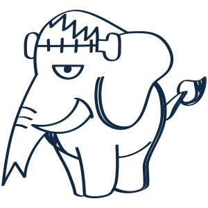

<!-- _class: title -->

# What is new in Sulu 3.1

Sulu Touch 2026

---

<!-- _header: Pre 3.1 -->

# 1. Symfony 8

## Symfony 8 for Sulu 3.0

Thx<figure></figure><figure></figure><figure></figure><figure></figure>...

<a class="pr-button" href="https://github.com/sulu/sulu-touch-2026-sulu-3.1/pull/1">Let's Code</a>

---

<!-- _header: Sulu 3.1 -->

# 2. Snippets

## Template groups
## Snippet shadows

Thx<figure></figure><figure></figure>

<a class="pr-button" href="https://github.com/sulu/sulu-touch-2026-sulu-3.1/pull/2">Let's Code</a>

---

<!-- _header: Sulu 3.1 -->

# 3. Text editor

## Configurable text editor configs
## Lang attributes

Thx<figure></figure><figure></figure><figure></figure>

<a class="pr-button" href="https://github.com/sulu/sulu-touch-2026-sulu-3.1/pull/3">Let's Code</a>

---

<!-- _header: Sulu 3.1 -->

# 4. Media

## AI disclosure (2.6)
## Limit parallel image generation
## Content Language definitions

Thx<figure></figure><figure></figure><figure></figure><figure></figure>

<a class="pr-button" href="https://github.com/sulu/sulu-touch-2026-sulu-3.1/pull/4">Let's Code</a>

---

<!-- _header: Sulu 3.1 -->

# 5. Content workflow

## Request, review and publish

Thx<figure></figure>

<a class="pr-button" href="https://github.com/sulu/sulu-touch-2026-sulu-3.1/pull/5">Let's Code</a>

---

<!-- _header: Sulu 3.1 -->

# 6. Notifications

## With deep links into the admin

Thx<figure></figure><figure></figure>

<a class="pr-button" href="https://github.com/sulu/sulu-touch-2026-sulu-3.1/pull/6">Let's Code</a>

---

<!-- _header: Sulu 3.1 -->

# 7. Preview to block

## Jump from the preview to the block

Thx<figure></figure><figure></figure><figure></figure>

<a class="pr-button" href="https://github.com/sulu/sulu-touch-2026-sulu-3.1/pull/7">Let's Code</a>

---

<!-- _header: Other / What is next -->

# 8. What is next

## Webspace Settings
## Out of the box FrankenPHP support

Thx<figure></figure><figure></figure>...

---

<!-- _header: Community -->

# Friends of Sulu

## A collection of community bundles for Sulu CMS

Thx<figure></figure>

<a class="pr-button" href="https://friendsofsulu.github.io/hub/">friendsofsulu.github.io/hub</a>

---

<!-- _class: statement -->

# Open Discussion

sulu.io

